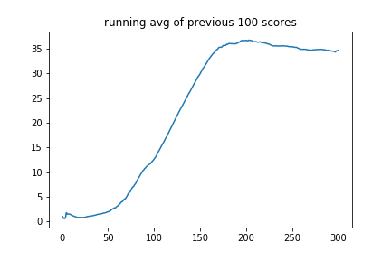

# Continous Control Project Report

## Introduction

In this project, I trained an agent to maintain its position at the target location for as many time steps as possible. In this environment, a double-jointed arm can move to target locations. A reward of +0.1 is provided for each step that the agent's hand is in the goal location. Thus, the goal of your agent is to maintain its position at the target location for as many time steps as possible.

The observation space consists of 33 variables corresponding to position, rotation, velocity, and angular velocities of the arm. Each action is a vector with four numbers, corresponding to torque applicable to two joints. Every entry in the action vector should be a number between -1 and 1.

I choose to solve the First Version that contains a single agent. The task is episodic, and in order to solve the environment, an agent must get an average score of +30 over 100 consecutive episodes.

## Solutions
In this project, I applied the DDPG algorithm to train an agent. The details about DDPG are given as follows:
* DDPG, or Deep Deterministic Policy Gradient, is an actor-critic, model-free algorithm based on the deterministic policy gradient that can operate over continuous action spaces. It combines the actor-critic approach with insights from DQNs: in particular, the insights that 1) the network is trained off-policy with samples from a replay buffer to minimize correlations between samples, and 2) the network is trained with a target Q network to give consistent targets during temporal difference backups

I adapt the code from the Udacity's example [ddpg-pendulum](https://github.com/udacity/deep-reinforcement-learning/tree/master/ddpg-pendulum) and [ShangtongZhang's github repo](https://github.com/ShangtongZhang/reinforcement-learning-an-introduction) to this project by making as few modifications as possible.

- Using Elu activation instead of Relu activation
- Using bigger Actor-Critic networks
- Using Gradient Clipping to prevent gradient vanishing/exploring

### 1. Actor-Critic networks

The Actor and CriticsNetworks are implemented in Pytorch. The Actor network containts 03 fully connected layers (512- 512 -4 units), 02 BatchNorm layers and Elu activation function. 

```python
class ActorNetwork(nn.Module):
    """Actor (Policy) Model."""

    def __init__(self, state_size, action_size, seed, fc1_dims = 512, fc2_dims = 512):
        """Initialize parameters and build model.
        Params
        ======
            state_size (int): Dimension of each state
            action_size (int): Dimension of each action
            seed (int): Random seed
            fc1_dims (int): Number of nodes in first hidden layer
            fc2_dims (int): Number of nodes in second hidden layer            

        """
        super(ActorNetwork, self).__init__()
        self.seed = torch.manual_seed(seed)
        self.fc1 = nn.Linear(state_size, fc1_dims)
        self.fc2 = nn.Linear(fc1_dims, fc2_dims)
        self.bn1 = nn.BatchNorm1d(fc1_dims)
        self.bn2 = nn.BatchNorm1d(fc2_dims)
        self.fc3 = nn.Linear(fc2_dims, action_size) 
```

The Critic network containts 04 fully connected layers (with 512-1024-512-1 units) and Elu activation function.

```python
class CriticNetwork(nn.Module):
    """Build a critic (value) network that maps (state, action) pairs -> Q-values."""

    def __init__(self, state_size, action_size, seed, fc1_dims = 512, fc2_dims = 512):
        """Initialize parameters and build model.
        Params
        ======
            state_size (int): Dimension of each state
            action_size (int): Dimension of each action
            seed (int): Random seed
            fc1_dims (int): Number of nodes in first hidden layer
            fc2_dims (int): Number of nodes in second hidden layer
        """
        super(CriticNetwork, self).__init__()
        self.seed = torch.manual_seed(seed)
        self.fc1 = nn.Linear(state_size, fc1_dims)
        self.fc2 = nn.Linear(action_size+ fc1_dims, 2*fc2_dims)
        self.fc3  = nn.Linear(2*fc2_dims , fc2_dims)  
        self.fc4 =  nn.Linear(fc2_dims , 1)
```

The hyperparameters are choosen from many attempts "trail and error" based on training sessions on the workplace's GPU provided by Udacity. These hyperparameters are given as follows:

```python
config = {"buffer_size": 1000000,  # replay buffer size
          "batch_size" : 128,        # minibatch size
          "gamma" : 0.99,            # discount factor
          "tau" : 1e-3,              # for soft update of target parameters
          "lr_actor" : 3e-4,         # learning rate of the actor 
          "lr_critic": 4e-4,        # learning rate of the critic
          "update": 4               # Update times of critic/actor in each trajectory
             }
n_games = 1000  # number of trajectories
max_t = 1000000 # Max timestep in a trajectory
```
### 2. Replay Buffer 
I create a ReplayBuffer that stores the last buffer_size S.A.R.S. (State, Action, Reward, New State) experiences.  During training, the agent will be trained on  #batch_size experiences (randomly sampling from the replay buffer). The agen will accumulate experiences through the replay-buffer until it (the buffer) has at least #batch_size experiences. 

Using replay memory allows to break the correlation between consecutive samples and help to improve the performance of the model. If the network learned only from consecutive samples of experience as they occurred sequentially in the environment, the samples would be highly correlated and would therefore lead to inefficient learning. Taking random samples from replay memory breaks this correlation.

### 3. Gradient clipping
In this project, I apply [Gradient Clipping](https://paperswithcode.com/method/gradient-clipping) to train Actor-Critic Network. Actually, Gradient Clipping clips the size of the gradients to ensure optimization performs more reasonably near sharp areas of the loss surface. It can be performed in a number of ways. One option is to simply clip the parameter gradient element-wise before a parameter update. Another option is to clip the norm ||g || of the gradient  before a parameter update:
if $\lVert g\lVert > v$ then  $g \leftarrow \frac{gv}{\lVert g\lVert}$    where  $v$ is a norm threshold.

In pytorch, I use ```python torch.nn.utils.clip_grad_norm_()```, Clips gradient norm of an iterable of parameters. The norm is computed over all gradients together, as if they were concatenated into a single vector. Gradients are modified in-place.

## Results
The agent is trained over 1000 episodes and acheived a high score. After 170 epiodes of training, the agent is able to get an average score of +35 rewards over 100 consecutive episodes. The learning curve and the training log can be found as beblow:



```
Episode 10	Average Score: 1.41	 score_actual: 0.50
Episode 20	Average Score: 0.85	 score_actual: 1.25
Episode 30	Average Score: 1.11	 score_actual: 2.37
Episode 40	Average Score: 1.48	 score_actual: 1.27
Episode 50	Average Score: 1.97	 score_actual: 4.20
Episode 60	Average Score: 3.11	 score_actual: 14.15
Episode 70	Average Score: 4.92	 score_actual: 24.97
Episode 80	Average Score: 7.65	 score_actual: 21.64
Episode 90	Average Score: 10.78	 score_actual: 39.05
Episode 100	Average Score: 12.63	 score_actual: 39.40
Episode 110	Average Score: 16.02	 score_actual: 31.64
Episode 120	Average Score: 19.71	 score_actual: 39.06
Episode 130	Average Score: 23.39	 score_actual: 35.24
Episode 140	Average Score: 26.86	 score_actual: 38.00
Episode 150	Average Score: 30.16	 score_actual: 36.17
Episode 160	Average Score: 33.16	 score_actual: 39.10
Episode 170	Average Score: 35.29	 score_actual: 38.56
Episode 180	Average Score: 36.04	 score_actual: 33.44
Episode 190	Average Score: 36.13	 score_actual: 39.07
Episode 200	Average Score: 36.70	 score_actual: 37.85
Episode 210	Average Score: 36.50	 score_actual: 37.69
Episode 220	Average Score: 36.18	 score_actual: 34.67
Episode 230	Average Score: 35.58	 score_actual: 33.94
Episode 240	Average Score: 35.62	 score_actual: 39.07
Episode 250	Average Score: 35.42	 score_actual: 26.12
Episode 260	Average Score: 34.87	 score_actual: 34.50
Episode 270	Average Score: 34.70	 score_actual: 39.03
Episode 280	Average Score: 34.89	 score_actual: 39.09
Episode 290	Average Score: 34.66	 score_actual: 37.22
Episode 300	Average Score: 34.66	 score_actual: 39.49
```

