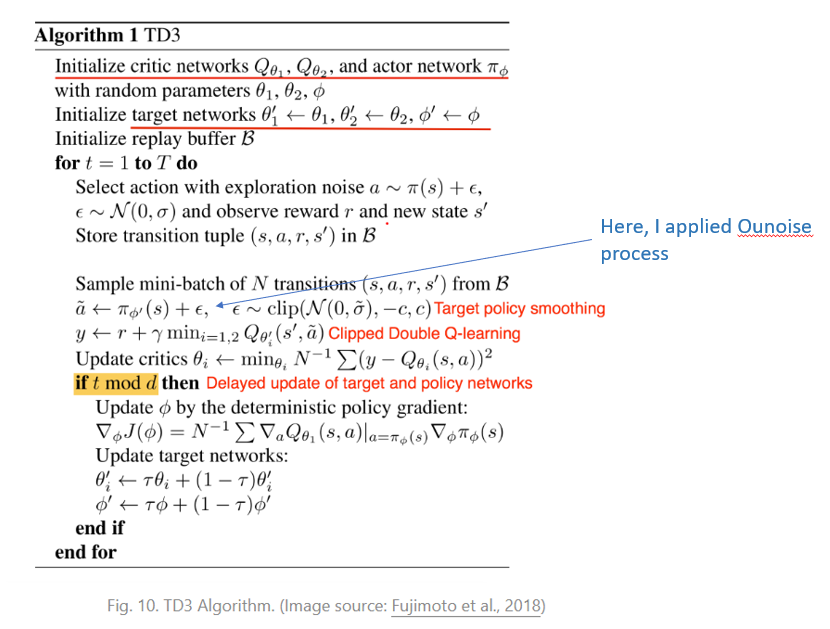

# Play Tennis Project Report

## Introduction

In this environment, two agents control rackets to bounce a ball over a net. If an agent hits the ball over the net, it receives a reward of +0.1. If an agent lets a ball hit the ground or hits the ball out of bounds, it receives a reward of -0.01. Thus, the goal of each agent is to keep the ball in play.

The observation space consists of 8 variables corresponding to the position and velocity of the ball and racket. Each agent receives its own, local observation. Two continuous actions are available, corresponding to movement toward (or away from) the net, and jumping.

The task is episodic, and in order to solve the environment, your agents must get an average score of +0.5 (over 100 consecutive episodes, after taking the maximum over both agents). Specifically,

* After each episode, we add up the rewards that each agent received (without discounting), to get a score for each agent. This yields 2 (potentially different) scores. We then take the maximum of these 2 scores.
* This yields a single score for each episode.

The environment is considered solved, when the average (over 100 episodes) of those scores is at least +0.5.


## Solutions
In this project, I applied Twin Delayed Deep Deterministic (short for TD3; Fujimoto et al., 2018) to train an agent. Twin Delayed Deep Deterministic (short for TD3; Fujimoto et al., 2018) applied a couple of tricks on DDPG to prevent the overestimation of the value function:

* Clipped Double Q-learning: In Double Q-Learning, the action selection and Q-value estimation are made by two networks separately. However, due to the slow changing policy, these two networks could be too similar to make independent decisions. The Clipped Double Q-learning instead uses the minimum estimation among two so as to favor underestimation bias which is hard to propagate through training.

* Delayed update of Target and Policy Networks: In the actor-critic model, policy and value updates are deeply coupled: Value estimates diverge through overestimation when the policy is poor, and the policy will become poor if the value estimate itself is inaccurate. To reduce the variance, TD3 updates the policy at a lower frequency than the Q-function. The policy network stays the same until the value error is small enough after several updates. The idea is similar to how the periodically-updated target network stay as a stable objective in DQN.

* Target Policy Smoothing: Given a concern with deterministic policies that they can overfit to narrow peaks in the value function, TD3 introduced a smoothing regularization strategy on the value function: adding a small amount of clipped random noises to the selected action and averaging over mini-batches.

Since there are 02 agents in this environment, I reshaped the dimension of action and state before feeding them into the actor/critic networks and environment in the training loops.

```python
for t in range(max_t):
	action = agent.choose_action(state)
	
	# Reshape action to the right shape used in env
	action = np.reshape(action, (2,2))

	env_info = env.step(action)[brain_name]        # send the action to the environment
	next_state = env_info.vector_observations   # get the next state
	reward = env_info.rewards                   # get the reward
	done = env_info.local_done[0]

	# Reshape next_state and action to the right shape used in agent
	next_state = np.reshape(next_state, (48,))
	action = np.reshape(action, (4,))
	
	agent.step(state, action, reward, next_state, done)
	state = next_state
	score += np.max(reward)
	
	if done:
		break

```

I adapt the code from [ShangtongZhang's github repo](https://github.com/ShangtongZhang/reinforcement-learning-an-introduction) and [Phil Tabor's github repo](https://github.com/philtabor/Actor-Critic-Methods-Paper-To-Code)to this project by making as few modifications as possible (see below)



## Actor-Critic networks

The Actor and CriticsNetworks are implemented in Pytorch. The Actor network containts 03 fully connected layers and 02 BatchNorm layers and Elu activation function. 

```python
class ActorNetwork(nn.Module):
    """Actor Model."""

    def __init__(self, state_size, action_size, seed, fc1_dims = 256, fc2_dims = 128):
        """Initialize parameters and build model.
        Params
        ======
            state_size (int): Dimension of each state
            action_size (int): Dimension of each action
            seed (int): Random seed
            fc1_dims (int): Number of nodes in first hidden layer
            fc2_dims (int): Number of nodes in second hidden layer

        """
        super(ActorNetwork, self).__init__()
        self.seed = torch.manual_seed(seed)
        self.fc1 = nn.Linear(state_size, fc1_dims)
        self.fc2 = nn.Linear(fc1_dims, fc2_dims)
        self.bn1 = nn.BatchNorm1d(fc1_dims)
        self.bn2 = nn.BatchNorm1d(fc2_dims)
        self.fc3 = nn.Linear(fc2_dims, action_size)        
         
        self.device = torch.device("cuda:0" if torch.cuda.is_available() else "cpu")
        self.to(self.device)
        self.reset_parameters()
```

The Critic network containts 04 fully connected layers and Elu activation function.

```python
class CriticNetwork(nn.Module):
    """Build a critic (value) network that maps (state, action) pairs -> Q-values."""

    def __init__(self, state_size, action_size, seed, fc1_dims = 256, fc2_dims = 128):
        """Initialize parameters and build model.
        Params
        ======
            state_size (int): Dimension of each state
            action_size (int): Dimension of each action
            seed (int): Random seed
            fc1_dims (int): Number of nodes in first hidden layer
            fc2_dims (int): Number of nodes in second hidden layer

        """
        super(CriticNetwork, self).__init__()
        self.seed = torch.manual_seed(seed)
        self.fc1 = nn.Linear(state_size, fc1_dims)
        self.bn1 = nn.BatchNorm1d(fc1_dims)
        self.fc2 = nn.Linear(action_size + fc1_dims, 2*fc2_dims)
        self.fc3  = nn.Linear(2*fc2_dims , fc2_dims)  
        self.fc4 =  nn.Linear(fc2_dims , 1)
              
        self.device = torch.device("cuda:0" if torch.cuda.is_available() else "cpu")
        self.to(self.device)        
        self.reset_parameters()
```

## Hyperparameters

The hyperparameters are choosen from many attempts "trail and error" based on training sessions on the workplace's GPU provided by Udacity. These hyperparameters are given as follows:

```python
config = {"buffer_size": 1000000,  # replay buffer size
          "batch_size" : 128,        # minibatch size
          "gamma" : 0.99,            # discount factor
          "tau" : 1e-3,              # for soft update of target parameters
          "lr_actor" : 4e-4,         # learning rate of the actor 
          "lr_critic": 4e-4,         # learning rate of the critic
          "update": 4,               # Update times of critic/actor in each trajectory
          "scale" : 5,               # initial scale of noise
          "scale_decay": 1e-4,       # scale decay
          "scale_end": 0
             }

```

## Results
The agent is trained over 1000 episodes and acheived a high score. After 898 epiodes of training, the agent is able to get an average score of +1.01 rewards over 100 consecutive episodes. The learning curve and the training log can be found as beblow:


and the log is here: 

```python
Episode 20	Average Score: 0.01	 score_max: 0.10
Episode 40	Average Score: 0.01	 score_max: 0.10
Episode 60	Average Score: 0.00	 score_max: 0.10
Episode 80	Average Score: 0.00	 score_max: 0.10
Episode 100	Average Score: 0.00	 score_max: 0.10
Episode 120	Average Score: 0.00	 score_max: 0.10
Episode 140	Average Score: 0.00	 score_max: 0.10
Episode 160	Average Score: 0.00	 score_max: 0.10
Episode 180	Average Score: 0.00	 score_max: 0.10
Episode 200	Average Score: 0.00	 score_max: 0.10
Episode 220	Average Score: 0.00	 score_max: 0.10
Episode 240	Average Score: 0.00	 score_max: 0.10
Episode 260	Average Score: 0.00	 score_max: 0.10
Episode 280	Average Score: 0.00	 score_max: 0.10
Episode 300	Average Score: 0.00	 score_max: 0.10
Episode 320	Average Score: 0.01	 score_max: 0.10
Episode 340	Average Score: 0.01	 score_max: 0.10
Episode 360	Average Score: 0.01	 score_max: 0.10
Episode 380	Average Score: 0.02	 score_max: 0.10
Episode 400	Average Score: 0.02	 score_max: 0.20
Episode 420	Average Score: 0.03	 score_max: 0.20
Episode 440	Average Score: 0.04	 score_max: 0.40
Episode 460	Average Score: 0.06	 score_max: 0.40
Episode 480	Average Score: 0.06	 score_max: 0.40
Episode 500	Average Score: 0.08	 score_max: 0.40
Episode 520	Average Score: 0.09	 score_max: 0.60
Episode 540	Average Score: 0.10	 score_max: 0.60
Episode 560	Average Score: 0.09	 score_max: 0.60
Episode 580	Average Score: 0.11	 score_max: 0.60
Episode 600	Average Score: 0.11	 score_max: 0.60
Episode 620	Average Score: 0.13	 score_max: 0.60
Episode 640	Average Score: 0.13	 score_max: 0.60
Episode 660	Average Score: 0.15	 score_max: 0.60
Episode 680	Average Score: 0.18	 score_max: 0.70
Episode 700	Average Score: 0.21	 score_max: 1.00
Episode 720	Average Score: 0.21	 score_max: 1.00
Episode 740	Average Score: 0.23	 score_max: 1.30
Episode 760	Average Score: 0.25	 score_max: 1.30
Episode 780	Average Score: 0.26	 score_max: 1.30
Episode 800	Average Score: 0.27	 score_max: 1.30
Episode 820	Average Score: 0.36	 score_max: 2.40
Episode 840	Average Score: 0.46	 score_max: 2.40
Episode 860	Average Score: 0.67	 score_max: 4.40
Episode 880	Average Score: 0.81	 score_max: 4.40
Episode 898	Average Score: 1.01	 score_max: 4.70
```

